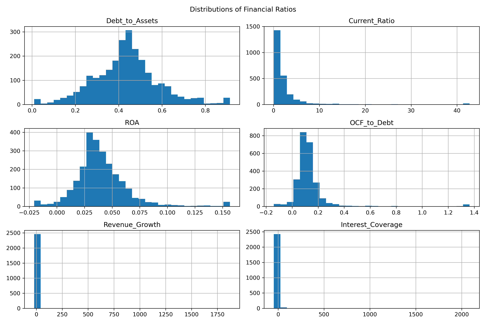
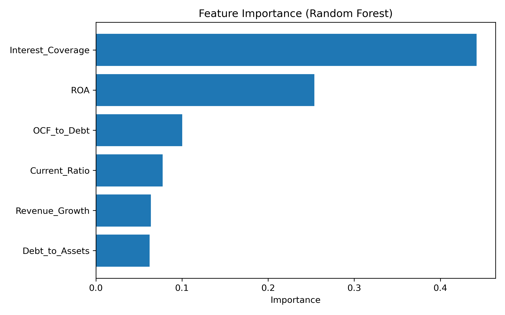

# Прогнозирование финансового дистресса компаний сектора недвижимости

## Описание проекта

Цель данного проекта — оценить способность традиционных финансовых коэффициентов прогнозировать финансовый дистресс публичных компаний сектора недвижимости.

На основе финансовой отчетности 270 компаний был сформирован панельный датасет за период **2014–2025 гг.**. На его основе были рассчитаны финансовые коэффициенты и построены модели прогнозирования вероятности финансового дистресса компаний в следующем периоде.

В работе используются методы **эконометрического анализа** и **машинного обучения**.

---

## Данные

Датасет содержит финансовую информацию по **270 публичным компаниям сектора недвижимости**.

Используются следующие типы данных:

- показатели баланса
- показатели отчета о прибылях и убытках
- показатели денежных потоков
- рыночные показатели

Каждое наблюдение представляет собой **компания–год**.

---

## Финансовые коэффициенты

В исследовании используются следующие показатели:

**Debt to Assets**

```
Debt_to_Assets = Total Debt / Total Assets
```

**Current Ratio**

```
Current_Ratio = Current Assets / Current Liabilities
```

**Return on Assets**

```
ROA = EBIT / Total Assets
```

**Operating Cash Flow to Debt**

```
OCF_to_Debt = Operating Cash Flow / Total Debt
```

**Interest Coverage**

```
Interest_Coverage = EBIT / Interest Expense
```

**Revenue Growth**

```
Revenue_Growth = (Revenue_t − Revenue_{t-1}) / Revenue_{t-1}
```

---

## Предобработка данных

На этапе подготовки данных были выполнены следующие шаги:

- преобразование финансовых показателей в числовой формат  
- удаление наблюдений с пропущенными значениями  
- ограничение выбросов  
- расчет финансовых коэффициентов  
- формирование индикатора финансового дистресса  
- создание целевой переменной **Distress_next_year**

Итоговый датасет содержит около **2700 наблюдений**.

---

## Разведочный анализ данных (EDA)

Были выполнены:

- анализ распределений финансовых коэффициентов
- корреляционный анализ
- сравнение distressed и non-distressed компаний

### Примеры визуализаций




---

## Используемые модели

В работе были протестированы следующие модели:

- Logistic Regression  
- Random Forest  

Качество моделей оценивалось с использованием:

- **F1-score**
- **ROC-AUC**
- **матрицы ошибок**

---

## Результаты

Наилучший результат показала модель **Random Forest**.

| Метрика | Значение |
|--------|--------|
| AUC | ~0.94 |
| F1-score | ~0.69 |

---

## Важность признаков

Наиболее значимые предикторы:

1. Interest Coverage  
2. ROA  
3. OCF_to_Debt  
4. Current Ratio  
5. Revenue Growth  



---

## Выводы

Результаты показывают, что финансовые коэффициенты обладают высокой прогностической силой при прогнозировании финансового дистресса компаний сектора недвижимости.

Наиболее важными факторами являются показатели прибыльности, операционных денежных потоков и способности обслуживать долговые обязательства.

---

## Структура репозитория

```
data/
    finance_data.xlsx

notebooks/
    baseline_analysis.ipynb

images/
    correlation_matrix.png
    feature_histograms.png
    feature_importance.png

README.md
```
