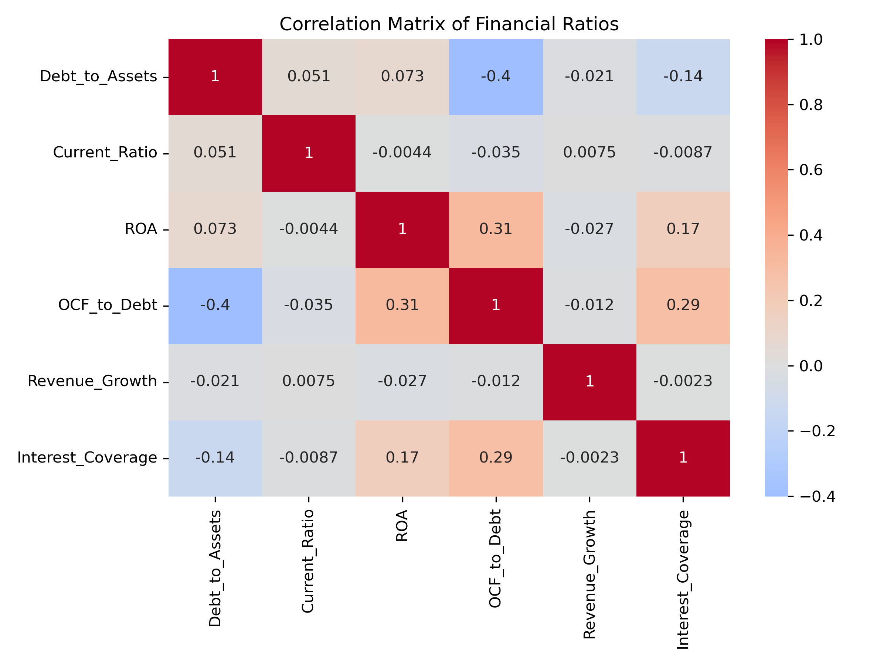
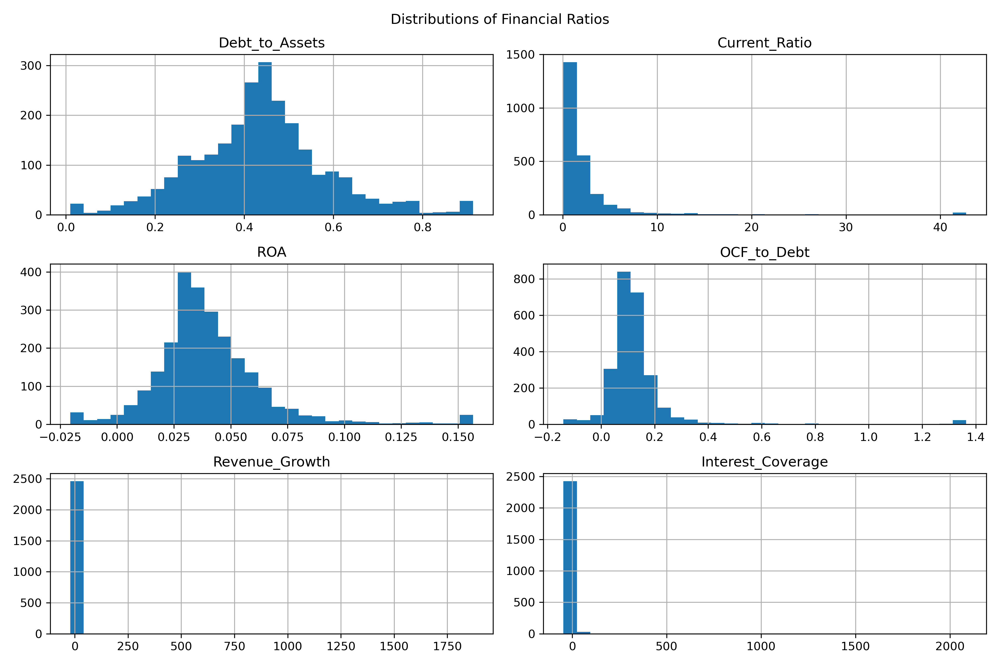
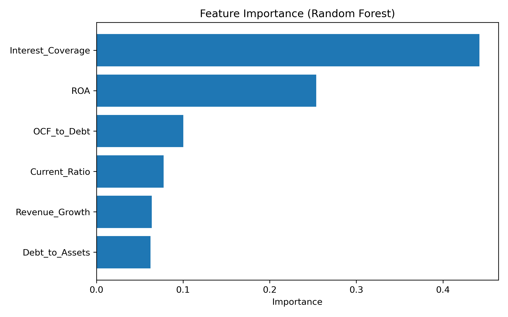
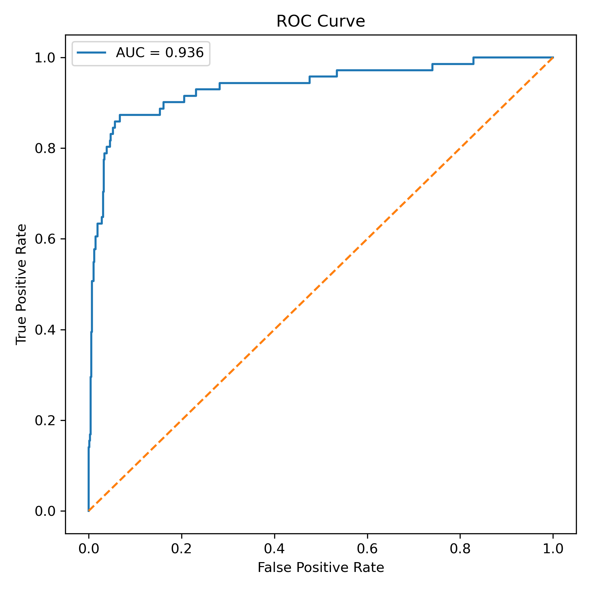

# Прогнозирование финансового дистресса компаний сектора недвижимости

## Описание проекта

Цель данного проекта — оценить способность традиционных финансовых коэффициентов прогнозировать финансовый дистресс публичных компаний сектора недвижимости.

На основе финансовой отчетности 270 компаний был сформирован панельный датасет за период **2014–2025 гг.**. На его основе были рассчитаны финансовые коэффициенты и построены модели прогнозирования вероятности финансового дистресса компаний в следующем периоде.

В работе используются методы **эконометрического анализа** и **машинного обучения**.

---

## Данные

Датасет содержит финансовую информацию по **270 публичным компаниям сектора недвижимости**.

Используются следующие типы данных:

- показатели баланса
- показатели отчета о прибылях и убытках
- показатели денежных потоков
- рыночные показатели

Каждое наблюдение представляет собой **компания–год**.

---

## Финансовые коэффициенты

В исследовании используются следующие показатели:

**Debt to Assets**

```
Debt_to_Assets = Total Debt / Total Assets
```

**Current Ratio**

```
Current_Ratio = Current Assets / Current Liabilities
```

**Return on Assets**

```
ROA = EBIT / Total Assets
```

**Operating Cash Flow to Debt**

```
OCF_to_Debt = Operating Cash Flow / Total Debt
```

**Interest Coverage**

```
Interest_Coverage = EBIT / Interest Expense
```

**Revenue Growth**

```
Revenue_Growth = (Revenue_t − Revenue_{t-1}) / Revenue_{t-1}
```

---

## Предобработка данных

На этапе подготовки данных были выполнены следующие шаги:

- преобразование финансовых показателей в числовой формат  
- удаление наблюдений с пропущенными значениями  
- ограничение выбросов  
- расчет финансовых коэффициентов  
- формирование индикатора финансового дистресса  
- создание целевой переменной **Distress_next_year**

Итоговый датасет содержит около **2700 наблюдений**.

---

## Разведочный анализ данных (EDA)

Были выполнены:

- анализ распределений финансовых коэффициентов
- корреляционный анализ
- сравнение distressed и non-distressed компаний

### Примеры визуализаций






---

## Используемые модели

В работе были протестированы следующие модели:

- Logistic Regression  
- Random Forest  

Качество моделей оценивалось с использованием:

- **F1-score**
- **ROC-AUC**
- **матрицы ошибок**

---

## Результаты

Наилучший результат показала модель **Random Forest**.

| Метрика | Значение |
|--------|--------|
| AUC | ~0.94 |
| F1-score | ~0.69 |

---

## Важность признаков

Наиболее значимые предикторы:

1. Interest Coverage  
2. ROA  
3. OCF_to_Debt  
4. Current Ratio  
5. Revenue Growth  




---

## Выводы

Результаты показывают, что финансовые коэффициенты обладают высокой прогностической силой при прогнозировании финансового дистресса компаний сектора недвижимости.

Наиболее важными факторами являются показатели прибыльности, операционных денежных потоков и способности обслуживать долговые обязательства.


| Company Name                                           | Exchange:Ticker    | Geographic Locations               | Primary Industry                |   Year |   Forecast_Year |   Distress_Probability |
|:-------------------------------------------------------|:-------------------|:-----------------------------------|:--------------------------------|-------:|----------------:|-----------------------:|
| NexPoint Residential Trust, Inc. (NYSE:NXRT)           | NYSE:NXRT          | United States and Canada (Primary) | Multi-Family Residential REITs  |   2021 |            2022 |               0.988701 |
| Apartment Investment and Management Company (NYSE:AIV) | NYSE:AIV           | United States and Canada (Primary) | Multi-Family Residential REITs  |   2021 |            2022 |               0.986731 |
| NexPoint Residential Trust, Inc. (NYSE:NXRT)           | NYSE:NXRT          | United States and Canada (Primary) | Multi-Family Residential REITs  |   2017 |            2018 |               0.981681 |
| Apartment Investment and Management Company (NYSE:AIV) | NYSE:AIV           | United States and Canada (Primary) | Multi-Family Residential REITs  |   2020 |            2021 |               0.98054  |
| Kennedy-Wilson Holdings, Inc. (NYSE:KW)                | NYSE:KW            | United States and Canada (Primary) | Real Estate Operating Companies |   2018 |            2019 |               0.979187 |
| NexPoint Residential Trust, Inc. (NYSE:NXRT)           | NYSE:NXRT          | United States and Canada (Primary) | Multi-Family Residential REITs  |   2019 |            2020 |               0.978565 |
| StorageVault Canada Inc. (TSX:SVI)                     | TSX:SVI            | United States and Canada (Primary) | Real Estate Operating Companies |   2020 |            2021 |               0.977775 |
| Kennedy-Wilson Holdings, Inc. (NYSE:KW)                | NYSE:KW            | United States and Canada (Primary) | Real Estate Operating Companies |   2017 |            2018 |               0.977529 |
| Kennedy-Wilson Holdings, Inc. (NYSE:KW)                | NYSE:KW            | United States and Canada (Primary) | Real Estate Operating Companies |   2016 |            2017 |               0.976474 |
| Kennedy-Wilson Holdings, Inc. (NYSE:KW)                | NYSE:KW            | United States and Canada (Primary) | Real Estate Operating Companies |   2024 |            2025 |               0.976052 |
| Kennedy-Wilson Holdings, Inc. (NYSE:KW)                | NYSE:KW            | United States and Canada (Primary) | Real Estate Operating Companies |   2023 |            2024 |               0.975912 |
| Veris Residential, Inc. (NYSE:VRE)                     | NYSE:VRE           | United States and Canada (Primary) | Multi-Family Residential REITs  |   2020 |            2021 |               0.974307 |
| Global Net Lease, Inc. (NYSE:GNL)                      | NYSE:GNL           | United States and Canada (Primary) | Diversified REITs               |   2023 |            2024 |               0.972819 |
| Kennedy-Wilson Holdings, Inc. (NYSE:KW)                | NYSE:KW            | United States and Canada (Primary) | Real Estate Operating Companies |   2020 |            2021 |               0.972784 |
| Diversified Healthcare Trust (NasdaqGS:DHC)            | NasdaqGS:DHC       | United States and Canada (Primary) | Health Care REITs               |   2021 |            2022 |               0.972639 |
| Diversified Healthcare Trust (NasdaqGS:DHC)            | NasdaqGS:DHC       | United States and Canada (Primary) | Health Care REITs               |   2024 |            2025 |               0.972064 |
| JLL Income Property Trust, Inc. (MutualFund:ZIPT.MX)   | MutualFund:ZIPT.MX | United States and Canada (Primary) | Diversified REITs               |   2022 |            2023 |               0.971936 |
| StorageVault Canada Inc. (TSX:SVI)                     | TSX:SVI            | United States and Canada (Primary) | Real Estate Operating Companies |   2019 |            2020 |               0.970522 |
| NexPoint Residential Trust, Inc. (NYSE:NXRT)           | NYSE:NXRT          | United States and Canada (Primary) | Multi-Family Residential REITs  |   2020 |            2021 |               0.970359 |
| Kennedy-Wilson Holdings, Inc. (NYSE:KW)                | NYSE:KW            | United States and Canada (Primary) | Real Estate Operating Companies |   2022 |            2023 |               0.969777 |
| Kennedy-Wilson Holdings, Inc. (NYSE:KW)                | NYSE:KW            | United States and Canada (Primary) | Real Estate Operating Companies |   2015 |            2016 |               0.969536 |
| Diversified Healthcare Trust (NasdaqGS:DHC)            | NasdaqGS:DHC       | United States and Canada (Primary) | Health Care REITs               |   2022 |            2023 |               0.969172 |
| StorageVault Canada Inc. (TSX:SVI)                     | TSX:SVI            | United States and Canada (Primary) | Real Estate Operating Companies |   2021 |            2022 |               0.96896  |
| Diversified Healthcare Trust (NasdaqGS:DHC)            | NasdaqGS:DHC       | United States and Canada (Primary) | Health Care REITs               |   2023 |            2024 |               0.968247 |
| Kennedy-Wilson Holdings, Inc. (NYSE:KW)                | NYSE:KW            | United States and Canada (Primary) | Real Estate Operating Companies |   2019 |            2020 |               0.968148 |
| Invitation Homes Inc. (NYSE:INVH)                      | NYSE:INVH          | United States and Canada (Primary) | Single-Family Residential REITs |   2017 |            2018 |               0.968027 |
| JBG SMITH Properties (NYSE:JBGS)                       | NYSE:JBGS          | United States and Canada (Primary) | Office REITs                    |   2024 |            2025 |               0.967977 |
| SL Green Realty Corp. (NYSE:SLG)                       | NYSE:SLG           | United States and Canada (Primary) | Office REITs                    |   2023 |            2024 |               0.967372 |
| Veris Residential, Inc. (NYSE:VRE)                     | NYSE:VRE           | United States and Canada (Primary) | Multi-Family Residential REITs  |   2019 |            2020 |               0.967139 |
| Invitation Homes Inc. (NYSE:INVH)                      | NYSE:INVH          | United States and Canada (Primary) | Single-Family Residential REITs |   2015 |            2016 |               0.96696  |
| JBG SMITH Properties (NYSE:JBGS)                       | NYSE:JBGS          | United States and Canada (Primary) | Office REITs                    |   2023 |            2024 |               0.966029 |
| SL Green Realty Corp. (NYSE:SLG)                       | NYSE:SLG           | United States and Canada (Primary) | Office REITs                    |   2024 |            2025 |               0.964407 |
| Phillips Edison & Company, Inc. (NasdaqGS:PECO)        | NasdaqGS:PECO      | United States and Canada (Primary) | Retail REITs                    |   2017 |            2018 |               0.96423  |
| Kennedy-Wilson Holdings, Inc. (NYSE:KW)                | NYSE:KW            | United States and Canada (Primary) | Real Estate Operating Companies |   2021 |            2022 |               0.964194 |
| Peakstone Realty Trust (NYSE:PKST)                     | NYSE:PKST          | United States and Canada (Primary) | Office REITs                    |   2024 |            2025 |               0.96184  |
| StorageVault Canada Inc. (TSX:SVI)                     | TSX:SVI            | United States and Canada (Primary) | Real Estate Operating Companies |   2018 |            2019 |               0.957252 |
| StorageVault Canada Inc. (TSX:SVI)                     | TSX:SVI            | United States and Canada (Primary) | Real Estate Operating Companies |   2017 |            2018 |               0.95589  |
| Veris Residential, Inc. (NYSE:VRE)                     | NYSE:VRE           | United States and Canada (Primary) | Multi-Family Residential REITs  |   2022 |            2023 |               0.954698 |
| SmartStop Self Storage REIT, Inc. (NYSE:SMA)           | NYSE:SMA           | United States and Canada (Primary) | Self-Storage REITs              |   2019 |            2020 |               0.954516 |
| Acadia Realty Trust (NYSE:AKR)                         | NYSE:AKR           | United States and Canada (Primary) | Retail REITs                    |   2023 |            2024 |               0.954183 |
| Hines Global Income Trust, Inc. (MutualFund:ZHGI.DX)   | MutualFund:ZHGI.DX | United States and Canada (Primary) | Diversified REITs               |   2021 |            2022 |               0.95404  |
| Ryman Hospitality Properties, Inc. (NYSE:RHP)          | NYSE:RHP           | United States and Canada (Primary) | Hotel and Resort REITs          |   2020 |            2021 |               0.95346  |
| NexPoint Residential Trust, Inc. (NYSE:NXRT)           | NYSE:NXRT          | United States and Canada (Primary) | Multi-Family Residential REITs  |   2015 |            2016 |               0.952658 |
| Centerspace (NYSE:CSR)                                 | NYSE:CSR           | United States and Canada (Primary) | Multi-Family Residential REITs  |   2020 |            2021 |               0.952623 |
| StorageVault Canada Inc. (TSX:SVI)                     | TSX:SVI            | United States and Canada (Primary) | Real Estate Operating Companies |   2015 |            2016 |               0.952527 |
| Veris Residential, Inc. (NYSE:VRE)                     | NYSE:VRE           | United States and Canada (Primary) | Multi-Family Residential REITs  |   2021 |            2022 |               0.951702 |
| NexPoint Residential Trust, Inc. (NYSE:NXRT)           | NYSE:NXRT          | United States and Canada (Primary) | Multi-Family Residential REITs  |   2018 |            2019 |               0.950846 |
| Hines Global Income Trust, Inc. (MutualFund:ZHGI.DX)   | MutualFund:ZHGI.DX | United States and Canada (Primary) | Diversified REITs               |   2019 |            2020 |               0.950832 |
| Park Hotels & Resorts Inc. (NYSE:PK)                   | NYSE:PK            | United States and Canada (Primary) | Hotel and Resort REITs          |   2020 |            2021 |               0.949654 |
| EPR Properties (NYSE:EPR)                              | NYSE:EPR           | United States and Canada (Primary) | Other Specialized REITs         |   2020 |            2021 |               0.949639 |
| Apartment Investment and Management Company (NYSE:AIV) | NYSE:AIV           | United States and Canada (Primary) | Multi-Family Residential REITs  |   2024 |            2025 |               0.949378 |
| Apartment Investment and Management Company (NYSE:AIV) | NYSE:AIV           | United States and Canada (Primary) | Multi-Family Residential REITs  |   2023 |            2024 |               0.949186 |
| American Healthcare REIT, Inc. (NYSE:AHR)              | NYSE:AHR           | United States and Canada (Primary) | Health Care REITs               |   2022 |            2023 |               0.949031 |
| Veris Residential, Inc. (NYSE:VRE)                     | NYSE:VRE           | United States and Canada (Primary) | Multi-Family Residential REITs  |   2018 |            2019 |               0.94836  |
| The Macerich Company (NYSE:MAC)                        | NYSE:MAC           | United States and Canada (Primary) | Retail REITs                    |   2020 |            2021 |               0.947794 |
| Acadia Realty Trust (NYSE:AKR)                         | NYSE:AKR           | United States and Canada (Primary) | Retail REITs                    |   2020 |            2021 |               0.947403 |
| NexPoint Residential Trust, Inc. (NYSE:NXRT)           | NYSE:NXRT          | United States and Canada (Primary) | Multi-Family Residential REITs  |   2022 |            2023 |               0.946282 |
| American Healthcare REIT, Inc. (NYSE:AHR)              | NYSE:AHR           | United States and Canada (Primary) | Health Care REITs               |   2021 |            2022 |               0.946059 |
| Park Hotels & Resorts Inc. (NYSE:PK)                   | NYSE:PK            | United States and Canada (Primary) | Hotel and Resort REITs          |   2021 |            2022 |               0.945537 |
| Acadia Realty Trust (NYSE:AKR)                         | NYSE:AKR           | United States and Canada (Primary) | Retail REITs                    |   2018 |            2019 |               0.945318 |
| RLJ Lodging Trust (NYSE:RLJ)                           | NYSE:RLJ           | United States and Canada (Primary) | Hotel and Resort REITs          |   2020 |            2021 |               0.944875 |
| StorageVault Canada Inc. (TSX:SVI)                     | TSX:SVI            | United States and Canada (Primary) | Real Estate Operating Companies |   2016 |            2017 |               0.944763 |
| Ryman Hospitality Properties, Inc. (NYSE:RHP)          | NYSE:RHP           | United States and Canada (Primary) | Hotel and Resort REITs          |   2021 |            2022 |               0.944462 |
| Phillips Edison & Company, Inc. (NasdaqGS:PECO)        | NasdaqGS:PECO      | United States and Canada (Primary) | Retail REITs                    |   2018 |            2019 |               0.944015 |
| Acadia Realty Trust (NYSE:AKR)                         | NYSE:AKR           | United States and Canada (Primary) | Retail REITs                    |   2021 |            2022 |               0.943638 |
| Veris Residential, Inc. (NYSE:VRE)                     | NYSE:VRE           | United States and Canada (Primary) | Multi-Family Residential REITs  |   2023 |            2024 |               0.942648 |
| Hines Global Income Trust, Inc. (MutualFund:ZHGI.DX)   | MutualFund:ZHGI.DX | United States and Canada (Primary) | Diversified REITs               |   2017 |            2018 |               0.94219  |
| JBG SMITH Properties (NYSE:JBGS)                       | NYSE:JBGS          | United States and Canada (Primary) | Office REITs                    |   2020 |            2021 |               0.942022 |
| Hines Global Income Trust, Inc. (MutualFund:ZHGI.DX)   | MutualFund:ZHGI.DX | United States and Canada (Primary) | Diversified REITs               |   2018 |            2019 |               0.941695 |
| Host Hotels & Resorts, Inc. (NasdaqGS:HST)             | NasdaqGS:HST       | United States and Canada (Primary) | Hotel and Resort REITs          |   2020 |            2021 |               0.941551 |
| Centerspace (NYSE:CSR)                                 | NYSE:CSR           | United States and Canada (Primary) | Multi-Family Residential REITs  |   2024 |            2025 |               0.939636 |
| Acadia Realty Trust (NYSE:AKR)                         | NYSE:AKR           | United States and Canada (Primary) | Retail REITs                    |   2022 |            2023 |               0.939166 |
| Hines Global Income Trust, Inc. (MutualFund:ZHGI.DX)   | MutualFund:ZHGI.DX | United States and Canada (Primary) | Diversified REITs               |   2016 |            2017 |               0.938842 |
| Postal Realty Trust, Inc. (NYSE:PSTL)                  | NYSE:PSTL          | United States and Canada (Primary) | Office REITs                    |   2019 |            2020 |               0.936503 |
| CIM Real Estate Finance Trust, Inc. (OTCPK:CMRF)       | OTCPK:CMRF         | United States and Canada (Primary) | Retail REITs                    |   2024 |            2025 |               0.936239 |
| RLJ Lodging Trust (NYSE:RLJ)                           | NYSE:RLJ           | United States and Canada (Primary) | Hotel and Resort REITs          |   2021 |            2022 |               0.935966 |
| Xenia Hotels & Resorts, Inc. (NYSE:XHR)                | NYSE:XHR           | United States and Canada (Primary) | Hotel and Resort REITs          |   2020 |            2021 |               0.93448  |
| JBG SMITH Properties (NYSE:JBGS)                       | NYSE:JBGS          | United States and Canada (Primary) | Office REITs                    |   2021 |            2022 |               0.934181 |
| American Healthcare REIT, Inc. (NYSE:AHR)              | NYSE:AHR           | United States and Canada (Primary) | Health Care REITs               |   2020 |            2021 |               0.934125 |
| Pebblebrook Hotel Trust (NYSE:PEB)                     | NYSE:PEB           | United States and Canada (Primary) | Hotel and Resort REITs          |   2021 |            2022 |               0.93404  |
| Medical Properties Trust, Inc. (NYSE:MPT)              | NYSE:MPT           | United States and Canada (Primary) | Health Care REITs               |   2023 |            2024 |               0.933797 |
| Veris Residential, Inc. (NYSE:VRE)                     | NYSE:VRE           | United States and Canada (Primary) | Multi-Family Residential REITs  |   2024 |            2025 |               0.933268 |
| Kite Realty Group Trust (NYSE:KRG)                     | NYSE:KRG           | United States and Canada (Primary) | Retail REITs                    |   2020 |            2021 |               0.932525 |
| Peakstone Realty Trust (NYSE:PKST)                     | NYSE:PKST          | United States and Canada (Primary) | Office REITs                    |   2023 |            2024 |               0.93157  |
| OUTFRONT Media Inc. (NYSE:OUT)                         | NYSE:OUT           | United States and Canada (Primary) | Other Specialized REITs         |   2020 |            2021 |               0.931273 |
| SmartStop Self Storage REIT, Inc. (NYSE:SMA)           | NYSE:SMA           | United States and Canada (Primary) | Self-Storage REITs              |   2016 |            2017 |               0.931106 |
| Pebblebrook Hotel Trust (NYSE:PEB)                     | NYSE:PEB           | United States and Canada (Primary) | Hotel and Resort REITs          |   2023 |            2024 |               0.930055 |
| Shaftesbury Capital PLC (LSE:SHC)                      | LSE:SHC            | United Kingdom (Primary)           | Diversified REITs               |   2020 |            2021 |               0.929797 |
| Kite Realty Group Trust (NYSE:KRG)                     | NYSE:KRG           | United States and Canada (Primary) | Retail REITs                    |   2021 |            2022 |               0.929323 |
| JLL Income Property Trust, Inc. (MutualFund:ZIPT.MX)   | MutualFund:ZIPT.MX | United States and Canada (Primary) | Diversified REITs               |   2020 |            2021 |               0.928989 |
| JBG SMITH Properties (NYSE:JBGS)                       | NYSE:JBGS          | United States and Canada (Primary) | Office REITs                    |   2022 |            2023 |               0.928074 |
| Xenia Hotels & Resorts, Inc. (NYSE:XHR)                | NYSE:XHR           | United States and Canada (Primary) | Hotel and Resort REITs          |   2021 |            2022 |               0.927238 |
| Healthcare Realty Trust Incorporated (NYSE:HR)         | NYSE:HR            | United States and Canada (Primary) | Health Care REITs               |   2022 |            2023 |               0.927207 |
| Pebblebrook Hotel Trust (NYSE:PEB)                     | NYSE:PEB           | United States and Canada (Primary) | Hotel and Resort REITs          |   2024 |            2025 |               0.924533 |
| Brandywine Realty Trust (NYSE:BDN)                     | NYSE:BDN           | United States and Canada (Primary) | Office REITs                    |   2023 |            2024 |               0.924508 |
| Hines Global Income Trust, Inc. (MutualFund:ZHGI.DX)   | MutualFund:ZHGI.DX | United States and Canada (Primary) | Diversified REITs               |   2024 |            2025 |               0.924375 |
| SmartStop Self Storage REIT, Inc. (NYSE:SMA)           | NYSE:SMA           | United States and Canada (Primary) | Self-Storage REITs              |   2017 |            2018 |               0.924352 |
| NexPoint Residential Trust, Inc. (NYSE:NXRT)           | NYSE:NXRT          | United States and Canada (Primary) | Multi-Family Residential REITs  |   2023 |            2024 |               0.923974 |
| Vornado Realty Trust (NYSE:VNO)                        | NYSE:VNO           | United States and Canada (Primary) | Office REITs                    |   2020 |            2021 |               0.922906 |
| Healthcare Realty Trust Incorporated (NYSE:HR)         | NYSE:HR            | United States and Canada (Primary) | Health Care REITs               |   2024 |            2025 |               0.922042 |

---

## Структура репозитория

```
data/
    finance_data.xlsx

notebooks/
    baseline_analysis.ipynb

images/
    correlation_matrix.png
    feature_histograms.png
    feature_importance.png

README.md
```
