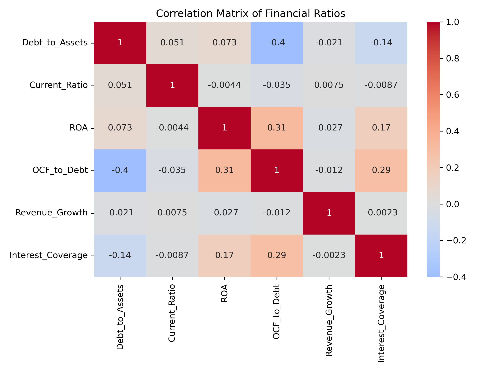
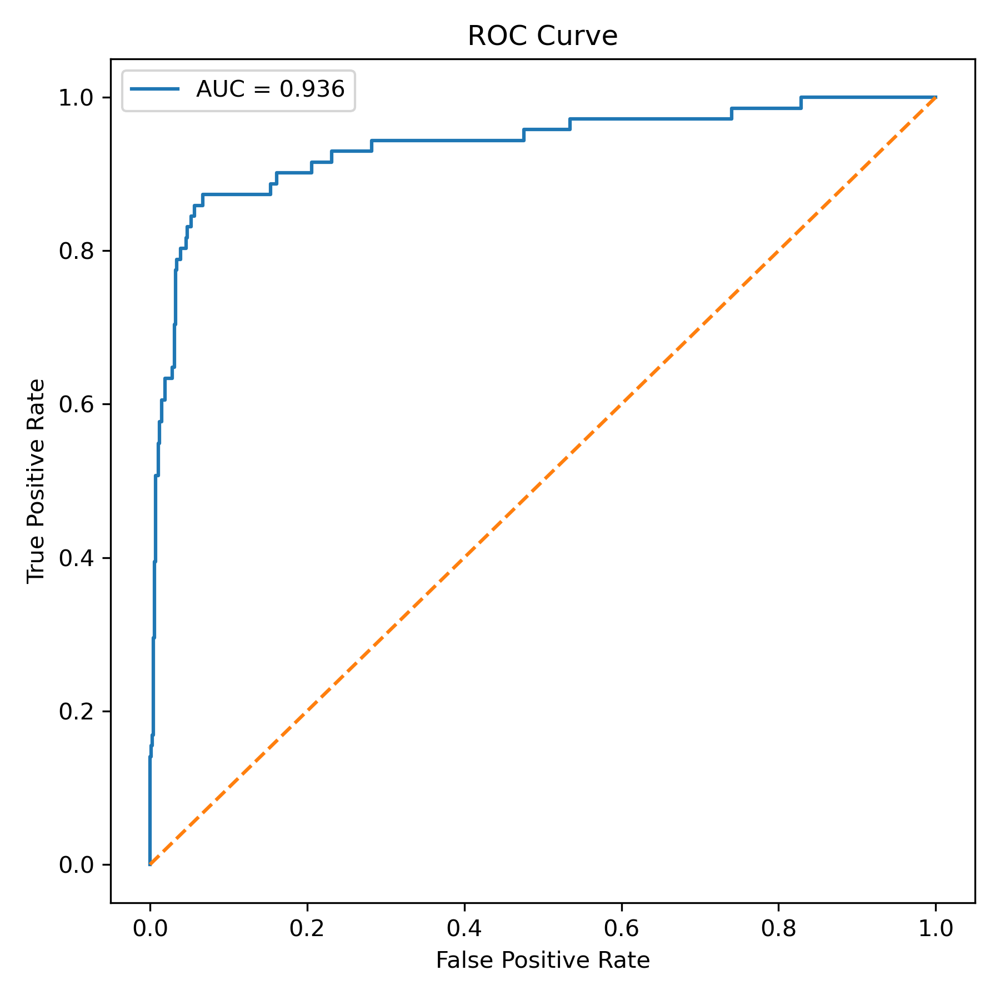

# Прогнозирование финансового дистресса компаний сектора недвижимости

## Описание проекта

Цель данного проекта — оценить способность традиционных финансовых коэффициентов прогнозировать финансовый дистресс публичных компаний сектора недвижимости.

На основе финансовой отчетности 270 компаний был сформирован панельный датасет за период **2014–2025 гг.**. На его основе были рассчитаны финансовые коэффициенты и построены модели прогнозирования вероятности финансового дистресса компаний в следующем периоде.

В работе используются методы **эконометрического анализа** и **машинного обучения**.

---

## Данные

Датасет содержит финансовую информацию по **270 публичным компаниям сектора недвижимости**.

Используются следующие типы данных:

- показатели баланса  
- показатели отчета о прибылях и убытках  
- показатели денежных потоков  
- рыночные показатели  

Каждое наблюдение представляет собой **компания–год**.

В проекте используются:

- обучающий датасет (train)
- тестовый датасет (test)
- объединённый датасет с прогнозами

---

## Финансовые коэффициенты

В исследовании используются следующие показатели:

**Debt to Assets**

```
Debt_to_Assets = Total Debt / Total Assets
```

**Current Ratio**

```
Current_Ratio = Current Assets / Current Liabilities
```

**Return on Assets**

```
ROA = EBIT / Total Assets
```

**Operating Cash Flow to Debt**

```
OCF_to_Debt = Operating Cash Flow / Total Debt
```

**Interest Coverage**

```
Interest_Coverage = EBIT / Interest Expense
```

**Revenue Growth**

```
Revenue_Growth = (Revenue_t − Revenue_{t-1}) / Revenue_{t-1}
```

---

## Предобработка данных

На этапе подготовки данных были выполнены следующие шаги:

- преобразование финансовых показателей в числовой формат  
- удаление пропусков  
- ограничение выбросов  
- расчет финансовых коэффициентов  
- формирование индикатора финансового дистресса  
- создание целевой переменной **Distress_next_year**

Итоговый датасет содержит около **2700 наблюдений**.

---

## Разведочный анализ данных (EDA)

Были выполнены:

- анализ распределений финансовых коэффициентов  
- корреляционный анализ  
- сравнение distressed и non-distressed компаний  

### Примеры визуализаций

  


---

## Используемые модели

В работе были протестированы следующие модели:

- Logistic Regression  
- Random Forest  

Качество моделей оценивалось с использованием:

- **F1-score**  
- **ROC-AUC**  
- **матрицы ошибок**

---

## Результаты

Наилучший результат показала модель **Random Forest**.

| Метрика | Значение |
|--------|--------|
| AUC | ~0.94 |
| F1-score | ~0.69 |

---

## Анализ ошибок модели

Матрица ошибок:

```
[[623  47]
 [  9  62]]
```

где:

- **True Negatives (TN)** = 623  
- **False Positives (Ошибка I рода)** = 47  
- **False Negatives (Ошибка II рода)** = 9  
- **True Positives (TP)** = 62  

### Интерпретация

**Ошибка I рода (False Positive)**  
Модель предсказывает дистресс, хотя его нет.

- уровень ошибки: **~7%**
- интерпретация: ложная тревога

---

**Ошибка II рода (False Negative)**  
Модель не выявляет дистресс, хотя он есть.

- уровень ошибки: **~12.7%**
- интерпретация: пропуск проблемной компании

---

### Вывод

- модель лучше выявляет устойчивые компании  
- при этом достаточно эффективно обнаруживает distressed компании  
- баланс ошибок достигается за счёт подбора threshold  

---

## Важность признаков

Наиболее значимые предикторы:

1. Interest Coverage  
2. ROA  
3. OCF_to_Debt  
4. Current Ratio  
5. Revenue Growth  

  


---

## Применение модели к тестовым данным

Обученная модель была применена к тестовому датасету.

Для тестовых данных были выполнены:

- те же преобразования признаков  
- расчет финансовых коэффициентов  
- формирование входных признаков  

В результате получены:

- вероятность финансового дистресса  
- бинарный прогноз  

---

## Итоговые датасеты

В рамках проекта сформированы:

- `real_estate_distress_panel_predictions.csv` — обучающий датасет  
- `real_estate_distress_panel_predictions_test.csv` — тестовый датасет  
- `real_estate_distress_predictions_full.xlsx` — объединённый датасет  

---

## Компании с наибольшей вероятностью дистресса

| Company Name | Exchange:Ticker | Geographic Locations | Primary Industry | Year | Forecast_Year | Distress_Probability |
|:------------|:----------------|:--------------------|:-----------------|-----:|--------------:|---------------------:|
| NexPoint Residential Trust, Inc. (NYSE:NXRT) | NYSE:NXRT | United States and Canada (Primary) | Multi-Family Residential REITs | 2021 | 2022 | 0.988701 |
| Apartment Investment and Management Company (NYSE:AIV) | NYSE:AIV | United States and Canada (Primary) | Multi-Family Residential REITs | 2021 | 2022 | 0.986731 |
| Kennedy-Wilson Holdings, Inc. (NYSE:KW) | NYSE:KW | United States and Canada (Primary) | Real Estate Operating Companies | 2018 | 2019 | 0.979187 |
| StorageVault Canada Inc. (TSX:SVI) | TSX:SVI | United States and Canada (Primary) | Real Estate Operating Companies | 2020 | 2021 | 0.977775 |
| Diversified Healthcare Trust (NasdaqGS:DHC) | NasdaqGS:DHC | United States and Canada (Primary) | Health Care REITs | 2021 | 2022 | 0.972639 |

---

## Выводы

Результаты показывают, что финансовые коэффициенты обладают высокой прогностической силой при прогнозировании финансового дистресса.

Ключевые выводы:

- наибольшее влияние оказывают показатели прибыльности и покрытия процентов  
- важную роль играют денежные потоки  
- модель Random Forest существенно превосходит линейные модели  
- модель успешно применяется к новым (тестовым) данным  

---

## Структура репозитория

```
data/
    finance_data.xlsx

notebooks/
    baseline_analysis.ipynb

images/
    correlation_matrix.png
    feature_histograms.png
    feature_importance.png
    roc_curve.png

outputs/
    real_estate_distress_panel_predictions.csv
    real_estate_distress_panel_predictions_test.csv
    real_estate_distress_predictions_full.xlsx

README.md
```
